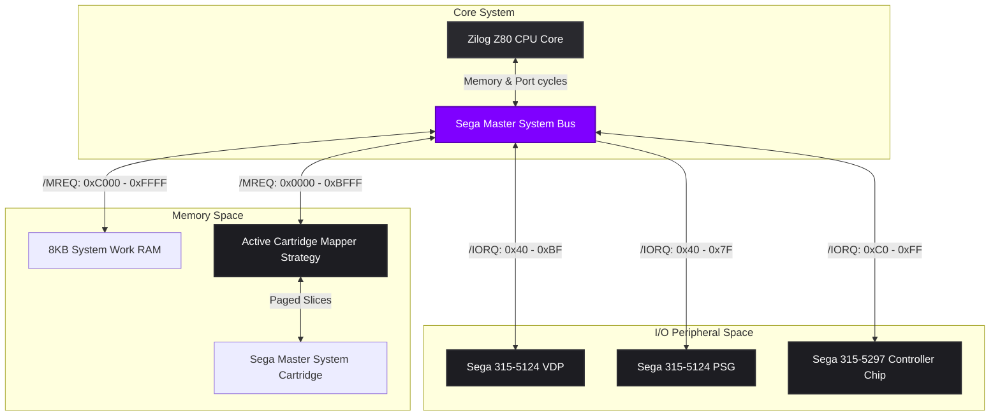
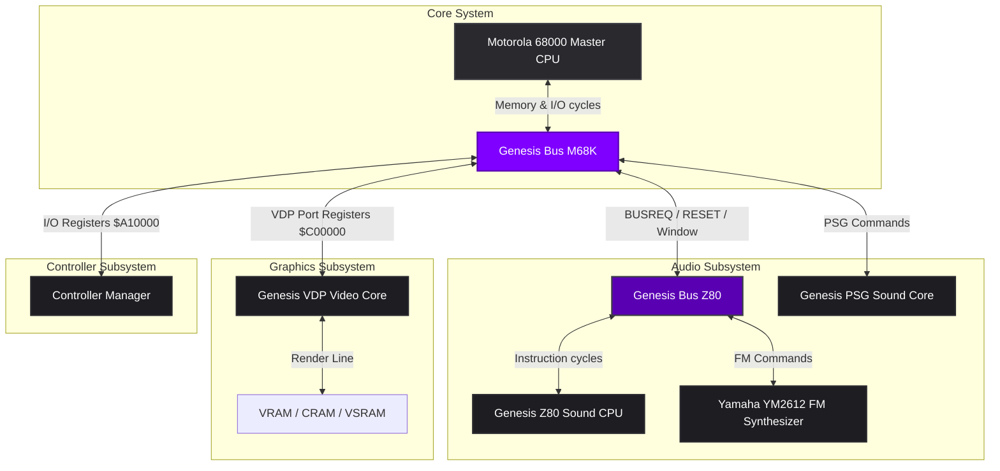
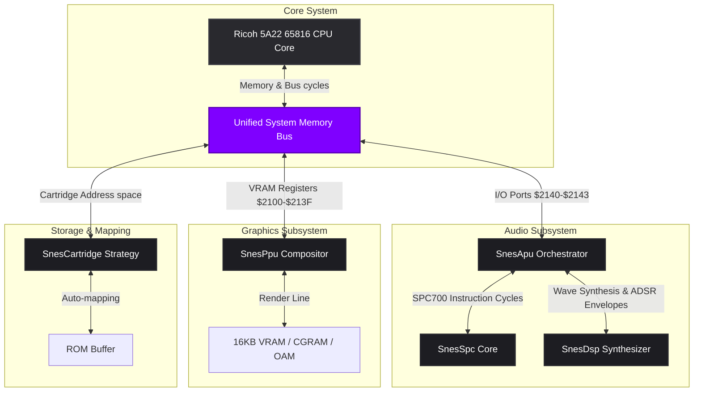

# EGGStation

> A highly decoupled, responsive, offline-first, and performance-optimized Multi-System Console Emulator supporting Sega Master System (SMS), Sega Genesis / Mega Drive (MD), and Super Nintendo (SNES), implemented in Vanilla ES6+ JavaScript.


---

## 1. Architectural Overview

EGGStation is engineered with a strict division of concerns, separating console-specific hardware logic, core processor modeling, and presentation abstractions. Rather than adhering to the tight-coupling paradigms common in monolithic emulators, this system decouples core hardware modules using **Domain-Driven Design (DDD)** and **SOLID** principles. This modular design allows Sega and Nintendo hardware domains to execute independently inside the same application container.

The codebase is organized into four distinct architectural layers:

```
                                  +------------------------------------+
                                  |         Presentation Layer         |
                                  |    (UIController / HTML5 / CSS3)   |
                                  +-----------------+------------------+
                                                    |
                                                    v
                                  +------------------------------------+
                                  |          Application Layer         |
                                  |      (EmulatorOrchestrator.js)     |
                                  +-----------------+------------------+
                                                    |
                                                    v
                                  +------------------------------------+
                                  |         Infrastructure Layer       |
                                  |      (VDP, PSG, State Serializer)  |
                                  +-----------------+------------------+
                                                    |
                                                    v
                                  +------------------------------------+
                                  |            Domain Layer            |
                                  |   (CPU, ALU, System Bus, Cartridge)|
                                  +-----------------+------------------+
```

*   **Domain Layer:** Models the core abstract hardware behavior, registers, execution clocks, address buses, and cartridge structures of the emulated consoles. It remains entirely isolated from browser-specific environments.
*   **Infrastructure Layer:** Implements standard visual output rendering engines (VDP, PPU), audio synthesizers (PSG, YM2612, DSP), and state serializers utilizing standard browser APIs (Canvas, Web Audio, IndexedDB).
*   **Application Layer:** Orchestrates the system's runtime loop, clock cycles synchronization, fast-forward states, temporal physics (rewind/stepping), and routes input and serialization triggers.
*   **Presentation Layer:** Handles DOM rendering, UI themes, custom tooltips, mobile virtual gamepad touch bindings, viewport scaling, and interactive settings tuning.

---

## 2. Hardware Architecture Deep-Dives

For an in-depth, low-level explanation of each console's physical hardware, custom chips, memory mapping structures, and execution timings, refer to the dedicated hardware deep-dive manuals below:

*   [Sega Master System & Mark III Hardware Specifications (SMS.md)](./SMS.md)
*   [Sega Genesis & Mega Drive Hardware Specifications (MD.md)](./MD.md)
*   [Super Nintendo (SNES) Hardware Specifications (SNES.md)](./SNES.md)

---

## 3. Hardware Component Interactions

### Sega Master System / Sega Mark III
The Sega Master System relies on a central Zilog Z80 processor interacting with dedicated hardware chips over a shared 16-bit Address Bus and 8-bit Data Bus. Below is the technical structural schematic of EGGStation's system communication paths:



### Sega Genesis / Mega Drive
The Sega Genesis coordinates execution between two distinct Central Processing Units (a primary Motorola 68000 and a secondary Zilog Z80) communicating via asynchronous bus request lines, and synchronizes synthesis commands with the Yamaha YM2612 FM and TI SN76489 PSG chips:



### Super Nintendo (SNES) / Super Famicom
The Super Nintendo relies on the 16-bit Ricoh 5A22 CPU coordinating execution alongside the Sony SPC700 sound CPU and a dual-chip custom Picture Processing Unit (PPU) over a multi-bus architecture:



---

## 4. Key Processor Decoupling

Following the **Single Responsibility Principle (SRP)**, the emulation of all central processors has been completely decoupled. The processor cores do not mutate memory directly, nor do they embed flag-setting mathematical routines inside instruction cycles.

*   **Zilog Z80 CPU Core (`ZilogZ80.js`):** Coordinates 8-bit instruction fetching, registers mapping, and flag operations, remaining entirely agnostic of the memory mapper strategies and sound chip. Reused as a secondary sound co-processor inside Sega Genesis (`GenesisZ80.js`).
*   **Motorola 68000 CPU Core (`m68000.js`):** Models the 16/32-bit linear address pipeline of the master Genesis processor, handling 12 hardware addressing modes, interrupts masking, and exception vectors.
*   **Ricoh 5A22 65816 CPU Core (`SnesCpu.js`):** Emulates the 8/16-bit 6502-compatible CPU, completely segregating addressing modes (`SnesCpuAddressing.js`), data transfers (`SnesCpuDataOps.js`), and logical operations (`SnesCpuLogic.js`) into clean prototype-extended modules.
*   **Sony SPC700 CPU Core (`SnesSpc.js`):** Emulates the custom 8-bit sound CPU inside the Super Nintendo, managing register state boundaries and mapping execution instructions.

---

## 5. Key Design Patterns and Implementations

### Strategy and Factory Patterns (Cartridge Auto-Mapping)
Cartridge PCBs utilized custom bank-switching mapper chips to address memory beyond standard CPU boundaries. EGGStation handles this via a dynamic **Strategy Pattern** decided by a **Factory Pattern** at startup:
*   **SMS Mappers:** Sega, Codemasters, and Korean mapper subclasses handle custom paging.
*   **SnesCartridge strategy:** Auto-detects LoROM or HiROM cart mappings by scanning the title checksums and complement structures at `$7FC0` and `$FFC0` on boot, bypassing manual configuration entirely.

### Zero-Allocation Hot Path & Inlined Bus Access
To secure stable execution speeds under standard browser environments, high-frequency core routines have been optimized to maintain a zero-GC footprint:
*   **Inlined Bus Cycles:** Static memory map lookups are inlined directly into `SnesSystemBus.getAccessTime()` and `SnesCpuAddressing.getAdr()`, removing millions of redundant function calls and lookups per second.
*   **Float32 Panning Pipelines:** Buffers inside `SnesDsp.js` are pre-allocated using typed float arrays, bypassing division and memory reallocation overhead.

### CPU-GPU Hybrid Scaling (Scale4X Optimization)
Transferring high-resolution pixel buffers from CPU memory to the GPU via canvas contexts (`putImageData`) is a major performance bottleneck in browsers. EGGStation resolves this using a **Hybrid Scaling Pipeline**:
*   **CPU Pass:** The CPU executes the initial `Scale2X` algorithm (optimized using *Loop Boundary Separation* to eliminate bounds checks inside the inner loop) to round and smooth vector curves at `1024x896` resolution.
*   **GPU Pass:** The browser's GPU hardware performs the final 2x upscale to reach `2048x1792` (Scale4X) using nearest-neighbor scaling (`image-rendering: pixelated`).
*   This hybrid approach reduces CPU and PCI-E bus loads by **75%**, locking the performance to a stable 60 FPS.

### Proportional Dynamic Rate Control (DRC)
To solve synchronization drift caused by non-deterministic browser thread events, EGGStation implements an advanced **Closed-Loop Proportional Dynamic Rate Control (DRC)** system:
*   The sound chips track the absolute **Clock Drift** ($e = \text{targetDrift} - \text{drift}$), measuring how many cycles the CPU is executing ahead of or behind the actual physical audio card playback.
*   A proportional feedback loop continuously throttles or accelerates the emulated clock cycles by up to **$\pm 8\%$** of native speeds, keeping the audio buffer in equilibrium and eliminating clicks or audio stutters.

---

## 6. Input Mappings & Controls

EGGStation maps inputs across keyboard, on-screen virtual pads, and physical USB/Bluetooth Gamepads simultaneously:

### Keyboard Layout
*   **Arrow Keys:** D-PAD Directions
*   **Key Z:** SMS Button 1 / Genesis Button A / SNES Button B
*   **Key X:** SMS Button 2 / Genesis Button B / SNES Button A
*   **Key C:** Genesis Button C / SNES Button R
*   **Key A:** Genesis Button X / SNES Button Y
*   **Key S:** Genesis Button Y / SNES Button X
*   **Key D:** Genesis Button Z / SNES Button L
*   **Shift:** SNES Select Button
*   **Enter:** Genesis Start / SNES Start Button

### Physical Gamepads Layout (Standard SNES Mapping)
*   **D-Pad / Left Analog Stick:** D-PAD Directions
*   **Button South (A on Xbox / B on Nintendo):** Button B
*   **Button West (X on Xbox / Y on Nintendo):** Button Y
*   **Button East (B on Xbox / A on Nintendo):** Button A
*   **Button North (Y on Xbox / X on Nintendo):** Button X
*   **Left Bumper (L1):** Left Shoulder (L)
*   **Right Bumper (R1):** Right Shoulder (R)
*   **Button Select (Back):** Select Button
*   **Button Start (Start):** Start Button

---

## 7. Diagnostics & Developer Mode

EGGStation includes a double diagnostic suite designed for both emulator validation and homebrew development:

### Interactive Developer Diagnostics Suite (Dev Mode)
Clicking the **"DEV MODE"** button in the header expands a retro diagnostic console at the footer:
*   **Debugger Core:** Allows developers to break/pause the CPU execution, step-into precisely one instruction, or bind a hexadecimal breakpoint address.
*   **Hex Registers Readout:** Renders all internal 16-bit and 32-bit CPU registers in uppercase hex, highlighting value changes.
*   **Disassembly Console:** Disassembles and displays active assembly instructions centered around the current Program Counter (PC).

---

## 8. License and Authorship

*   **Project Name:** EGGStation Multi-System Emulator
*   **Author:** Enrique González Gutiérrez
*   **Technology Stack:** Vanilla JavaScript (ES6+), WebGL2, Web Audio API, IndexedDB.
*   **License:** Distributed under the terms of the MIT License. See [LICENSE](LICENSE) for details.