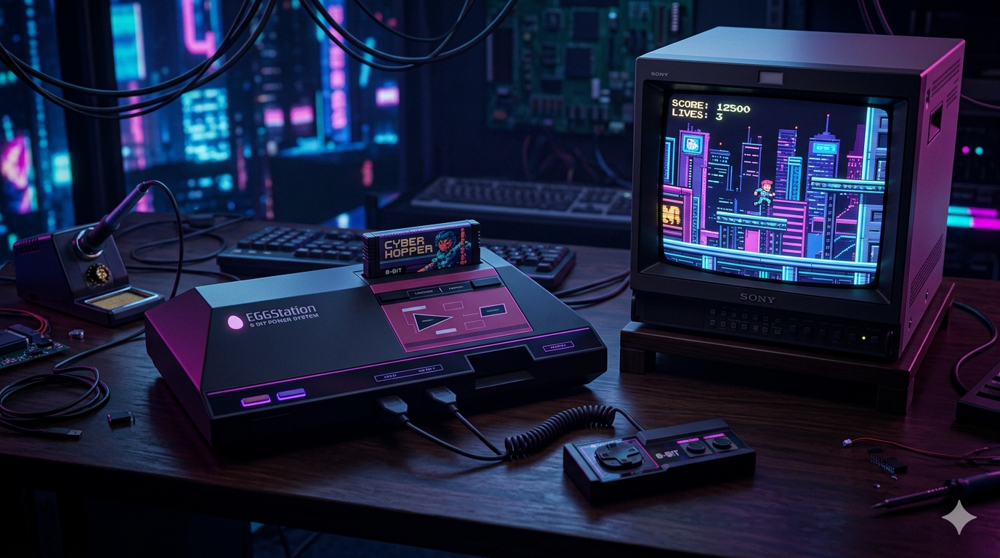
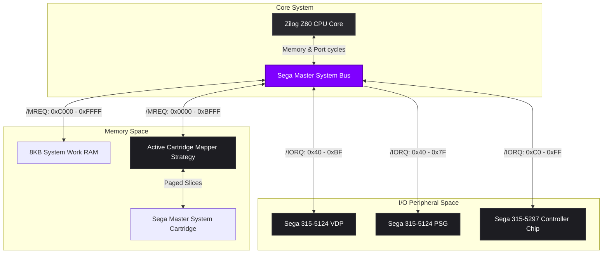
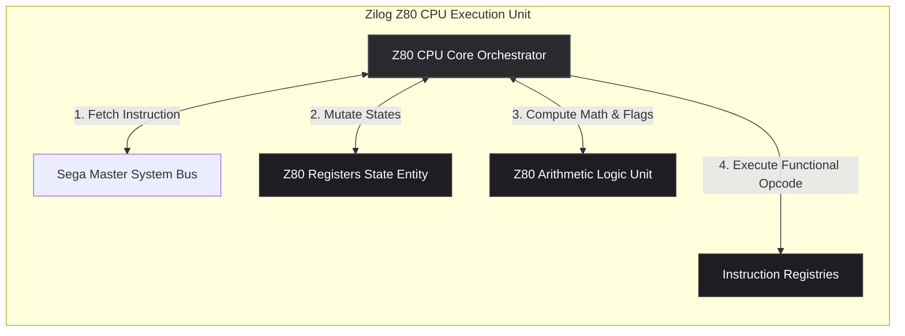

# EGGStation

> A decoupled, responsive, and performance-optimized Sega Master System (SMS) & SG-1000 console emulator implemented in Vanilla ES6+ JavaScript.



---

## 1. Architectural Overview

EGGStation is engineered with a strict division of concerns, separating console-specific hardware logic, core processor modeling, and presentation abstractions. Rather than adhering to the tight-coupling paradigms common in monolithic emulators, this system decouples core hardware modules using **Domain-Driven Design (DDD)** and **SOLID** principles.

The codebase is organized into four distinct architectural layers:

```
                                  +------------------------------------+
                                  |         Presentation Layer         |
                                  |    (UIController / HTML5 / CSS3)   |
                                  +-----------------+------------------+
                                                    |
                                                    v
                                  +------------------------------------+
                                  |          Application Layer         |
                                  |      (EmulatorOrchestrator.js)     |
                                  +-----------------+------------------+
                                                    |
                                                    v
                                  +------------------------------------+
                                  |         Infrastructure Layer       |
                                  |      (VDP, PSG, State Serializer)  |
                                  +-----------------+------------------+
                                                    |
                                                    v
                                  +------------------------------------+
                                  |            Domain Layer            |
                                  |   (CPU, ALU, System Bus, Cartridge)|
                                  +------------------------------------+
```

*   **Domain Layer:** Models the core abstract hardware behavior, constraints, and business logic of the console (such as CPU registers, clock cycles, address buses, DB-9 input port definitions, and raw cartridge data structures). It remains entirely isolated from browser-specific environments.
*   **Infrastructure Layer:** Implements standard visual output rendering engines (VDP), audio synthesizers (PSG), and state serializers utilizing standard browser APIs (Canvas, Web Audio, LocalStorage).
*   **Application Layer:** Orchestrates the system's runtime loop, clock cycles synchronization, fast-forward states, and routes input and serialization triggers.
*   **Presentation Layer:** Handles DOM rendering, UI themes, custom tooltips, mobile virtual gamepad touch bindings, and viewport scaling.

---

## 2. Hardware Component Interactions

The Sega Master System relies on a central Zilog Z80 processor interacting with dedicated hardware chips over a shared 16-bit Address Bus and 8-bit Data Bus. Below is the technical structural schematic of EGGStation's system communication paths:



---

## 3. Zilog Z80 Processor Decoupling

Following the **Single Responsibility Principle (SRP)**, the emulation of the Zilog Z80 processor has been completely decoupled. The processor logic does not mutate memory directly, nor does it embed flag-setting mathematical routines inside instruction cycles.



*   **Z80 Registers Entity (`Z80Registers.js`):** Encapsulates primary, alternate (shadow), index registers, program counters, and interrupt enable flip-flops (IFF1/IFF2). Exposes clean 16-bit virtual pairs (BC, DE, HL, AF, IX, IY) using getters and setters.
*   **Z80 ALU (`Z80Alu.js`):** Contains pure mathematical functions (ADC, SBC, ADD, SUB, shifts, rotations, and BCD decimal adjustments). Resolves and calculates CPU flags deterministically, including pre-computing parity lookup tables.
*   **Instruction Registries:** Decoupled functional arrays mapping standard, extended (ED), bitwise (CB), and indexed (DD, FD, DDCB, FDCB) execution routines into specific static registries to avoid bloated conditional blocks.

---

## 4. Key Design Patterns and Implementations

### Strategy and Factory Patterns (Cartridge Paging)
Sega Master System cartridges frequently utilized custom mapper chips on their PCBs to expand memory configurations beyond the standard 64KB addressing space of the Z80. EGGStation handles this via a dynamic **Strategy Pattern** decided by a **Factory Pattern** at startup:

*   **SegaMapper:** Standard SEGA paging, protecting the first 1KB of address space (to preserve Z80 vector jump tables) and routing Cartridge battery-backed Save RAM inside slot 2.
*   **CodemastersMapper:** Intercepts write cycles on offsets `0x0000`, `0x4000`, and `0x8000` to page banks, without protecting vector memory.
*   **KoreanMapper:** Locks banks 0 and 1, only allowing Slot 2 swaps via write captures on `0xA000`.
*   **SegaMasterSystemMapperFactory:** Dynamically parses unique ROM checksums and file sizes to select and load the corresponding mapper subclass strategy.

### Zero-Allocation Hot Path (Audio Synthesis Optimization)
To ensure smooth, pop-free audio processing under standard browser execution conditions, the audio engine (`Sega315_5124_Psg.js`) has been optimized using a **Zero-Allocation Hot Path**:
*   All temporal variables, loop indexes, phase registers, and calculations are pre-allocated inside the constructor.
*   By avoiding the use of inline declarations (`let`, `const`, `{}`) inside the script processor audio threads (`mixFunction` and `mixVoices`), we eliminate runtime Garbage Collection (GC) thrashing.
*   The ScriptProcessor is configured with an expanded **2048-sample safety buffer** to absorb frame-rate jitter and standard browser thread delays without causing audio drop-outs.

### Responsive Viewport & Touch Virtual Gamepad
EGGStation supports responsive playing across desktop PCs, laptops, tablets, and mobile devices:
*   **Fluid Scaling:** The HTML5 Canvas uses modern CSS properties (`aspect-ratio: 256 / 240` and `image-rendering: pixelated`) to scale smoothly to fill any container size while retaining crisp, pixel-perfect rendering.
*   **Virtual Gamepad:** When opened on touchscreen devices, a virtual DB-9 Controller overlay is automatically activated.
*   **Touch Locking:** The presentation layer controller (`UIController.js`) maps multi-touch coordinates and stops default OS gestures via `preventDefault()` to prevent zooming or page shifting during active gameplay.

### High-Precision Timing Loop
To prevent timing drift and frame-rate stutter caused by standard non-deterministic browser events (`setTimeout`), EGGStation implements a **Delta-Time Accumulator** driven by the Web API's high-resolution clock (`performance.now()`) and synchronized with the browser's display refresh rate (`requestAnimationFrame`):

```javascript
let deltaTime = currentTime - lastTime;
accumulatedTime += deltaTime;

while (accumulatedTime >= targetFrameTime) {
    executeFrame(targetFps); // Simulate target CPU cycles per frame
    accumulatedTime -= targetFrameTime;
}
```
This isolates the speed of the emulator from the browser's actual display refresh rate (Hz), meaning the software runs at a stable, uniform speed whether rendered on a standard 60Hz, 120Hz, or 144Hz monitor.

---

## 5. Development and Diagnostics

EGGStation includes a standardized diagnostics suite to run cycle-accurate verification tests. It feeds mock execution data, initial registers, and memories from JSON test files into the specialized `Z80DiagnosticMemory` layer and matches resulting register states post-execution.

To run diagnostic test suites:
1. Open the application in development mode with the diagnostic panel visible.
2. Select any prefix test suite button (Standard, CB, ED, DD, FD, etc.) at the bottom of the interface.
3. Inspect results inside the browser's web inspector console.

---

## 6. License and Authorship

*   **Project Name:** EGGStation SMS Emulator
*   **Author:** Enrique González Gutiérrez
*   **Technology Stack:** Vanilla JavaScript (ES6+), HTML5 Canvas, Web Audio API, Web LocalStorage API.
*   **License:** Distributed under the terms of the MIT License. See [LICENSE](LICENSE) for details.