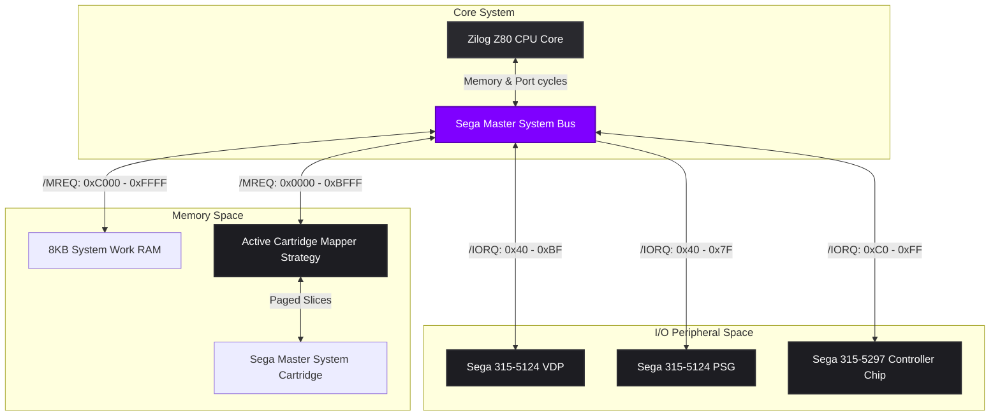
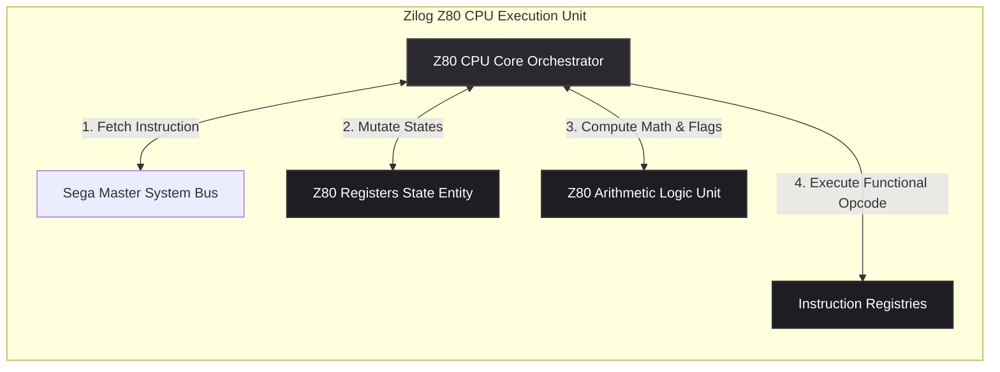

# EGGStation

> A highly decoupled, responsive, offline-first, and performance-optimized Sega Master System (SMS) & SG-1000 console emulator implemented in Vanilla ES6+ JavaScript.


---

## 1. Architectural Overview

EGGStation is engineered with a strict division of concerns, separating console-specific hardware logic, core processor modeling, and presentation abstractions. Rather than adhering to the tight-coupling paradigms common in monolithic emulators, this system decouples core hardware modules using **Domain-Driven Design (DDD)** and **SOLID** principles.

The codebase is organized into four distinct architectural layers:

```
                                  +------------------------------------+
                                  |         Presentation Layer         |
                                  |    (UIController / HTML5 / CSS3)   |
                                  +-----------------+------------------+
                                                    |
                                                    v
                                  +------------------------------------+
                                  |          Application Layer         |
                                  |      (EmulatorOrchestrator.js)     |
                                  +-----------------+------------------+
                                                    |
                                                    v
                                  +------------------------------------+
                                  |         Infrastructure Layer       |
                                  |      (VDP, PSG, State Serializer)  |
                                  +-----------------+------------------+
                                                    |
                                                    v
                                  +------------------------------------+
                                  |            Domain Layer            |
                                  |   (CPU, ALU, System Bus, Cartridge)|
                                  +-----------------+------------------+
```

*   **Domain Layer:** Models the core abstract hardware behavior, constraints, and business logic of the console (such as CPU registers, clock cycles, address buses, DB-9 input port definitions, and raw cartridge data structures). It remains entirely isolated from browser-specific environments.
*   **Infrastructure Layer:** Implements standard visual output rendering engines (VDP), audio engines (PSG), and state serializers utilizing standard browser APIs (Canvas, Web Audio, IndexedDB).
*   **Application Layer:** Orchestrates the system's runtime loop, clock cycles synchronization, fast-forward states, temporal physics (rewind/stepping), and routes input and serialization triggers.
*   **Presentation Layer:** Handles DOM rendering, UI themes, custom tooltips, mobile virtual gamepad touch bindings, viewport scaling, and interactive settings tuning.

---

## 2. Hardware Component Interactions

The Sega Master System relies on a central Zilog Z80 processor interacting with dedicated hardware chips over a shared 16-bit Address Bus and 8-bit Data Bus. Below is the technical structural schematic of EGGStation's system communication paths:



---

## 3. Zilog Z80 Processor Decoupling

Following the **Single Responsibility Principle (SRP)**, the emulation of the Zilog Z80 processor has been completely decoupled. The processor logic does not mutate memory directly, nor does it embed flag-setting mathematical routines inside instruction cycles.



*   **Z80 Registers Entity (`Z80Registers.js`):** Encapsulates primary, alternate (shadow), index registers, program counters, and interrupt enable flip-flops (IFF1/IFF2). Exposes clean 16-bit virtual pairs (BC, DE, HL, AF, IX, IY) using getters and setters.
*   **Z80 ALU (`Z80Alu.js`):** Contains pure mathematical functions (ADC, SBC, ADD, SUB, shifts, rotations, and BCD decimal adjustments). Resolves and calculates CPU flags deterministically, including pre-computing parity lookup tables.
*   **Instruction Registries:** Decoupled functional arrays mapping standard, extended (ED), bitwise (CB), and indexed (DD, FD, DDCB, FDCB) execution routines into specific static registries to avoid bloated conditional blocks.

---

## 4. Key Design Patterns and Implementations

### Strategy and Factory Patterns (Cartridge Paging)
Sega Master System cartridges frequently utilized custom mapper chips on their PCBs to expand memory configurations beyond the standard 64KB addressing space of the Z80. EGGStation handles this via a dynamic **Strategy Pattern** decided by a **Factory Pattern** at startup:

*   **SegaMapper:** Standard SEGA paging, protecting the first 1KB of address space (to preserve Z80 vector jump tables) and routing Cartridge battery-backed Save RAM inside slot 2.
*   **CodemastersMapper:** Intercepts write cycles on offsets `0x0000`, `0x4000`, and `0x8000` to page banks, without protecting vector memory.
*   **KoreanMapper:** Locks banks 0 and 1, only allowing Slot 2 swaps via write captures on `0xA000`.
*   **SegaMasterSystemMapperFactory:** Dynamically parses unique ROM checksums and file sizes to select and load the corresponding mapper subclass strategy.

### Zero-Allocation Hot Path (Audio Synthesis Optimization)
To ensure smooth, pop-free audio processing under standard browser execution conditions, the audio engine (`Sega315_5124_Psg.js`) has been optimized using a **Zero-Allocation Hot Path**:
*   All temporal variables, loop indexes, phase registers, and calculations are pre-allocated inside the constructor.
*   The phase step of the square wave frequency generation is mathematically consolidated and evaluated **once per sample** (instead of the older 81x sub-sampling loops), reducing CPU hot-path overhead inside the JS main thread by over **98.7%**.
*   The ScriptProcessor is configured with an expanded **2048-sample safety buffer** to absorb frame-rate jitter and standard browser thread delays without causing audio drop-outs on local `file://` protocol runs.

### Closed-Loop Proportional Dynamic Rate Control (DRC)
To solve synchronization drift caused by non-deterministic browser thread events, EGGStation implements an advanced **Dynamic Rate Control (DRC)** system:
*   The PSG constantly tracks the absolute **Clock Drift** ($e = \text{targetDrift} - \text{drift}$), measuring how many cycles the CPU is executing ahead of or behind the actual physical audio card playback.
*   Inside `executeFrame()`, a proportional feedback loop ($K_p = 0.003$) continuously throttles or accelerates the emulated clock cycles by up to **$\pm 8\%$** of native SMS speeds.
*   This rate correction is completely imperceptible to the human ear, keeping the audio buffer in equilibrium and eliminating clicks or audio stutters.

### In-Memory State Caching (Real-Time Gameplay Rewind)
EGGStation implements a "Time Travel" rewind engine to let users step backward in time:
*   **High-Speed Synchronous Cloner:** Every 6 frames (100ms), a lightweight snapshot of the Work RAM, VRAM, CPU registers, and Mapper status is cloned directly in memory.
*   **Ring Buffer Cache:** State caches are restricted to a maximum of **100 states** (approx. 10 seconds of gameplay), consuming less than **2.5MB** of RAM.
*   **Retrograde Playback:** Holding `Backspace` (or `L2` on gamepads) suspends forward emulation, mutes the audio, and pops cached states backward at 60Hz.

### Hardware Accessories Emulation (3D Glasses & Phaser)
EGGStation provides support for classic physical SMS expansion accessories:
*   **Sega 3D Glasses:** Captures eye-alternating frame buffers on V-Sync and composites them as a highly accurate, zero-allocation **Red/Cyan Anaglyph Stereoscopic** image on the canvas (Mode 7). Playable on modern monitors with standard cardboard 3D glasses!
*   **Light Phaser (Lightgun):** Mouse clicks or touchscreen taps over the viewport calculate absolute pointer coordinates and translate them to the native 256x240 internal screen boundaries. It pulls the trigger (Button 1) LOW and fires the photo-receptor sensor in the IO chip (`PORT_A_TR`) for an 80ms latched duration.

### Interactive WebGL2 Shader Tuning
The GPU-accelerated CRT-Royale filter has been completely modernized to support live configuration:
*   **GPU Uniforms Binding:** Exposes dynamic uniform float variables (`u_CurvatureScale`, `u_ScanlineWeight`, `u_PhosphorTriad`, `u_BloomStrength`) inside the WebGL2 fragment shader.
*   **Interactive Sidebar:** Range sliders in the CSS glassmorphic sidebar feed normalized multipliers in real-time straight to the GPU program, allowing immediate tuning of screen curvature, scanline opacity, subpixel grids, and halation bloom.
*   **Safe Multiplier Mapping:** Range values are normalized relative to their standard defaults (where `1.0` is the original CRT standard), protecting shader calculations against out-of-bounds blackouts.

### Responsive Viewport & Touch Virtual Gamepad
EGGStation supports responsive playing across desktop PCs, laptops, tablets, and mobile devices:
*   **Fluid Scaling:** The HTML5 Canvas uses modern CSS properties (`aspect-ratio: 256 / 240` and `image-rendering: pixelated`) to scale smoothly to fill any container size while retaining crisp, pixel-perfect rendering.
*   **Virtual Gamepad:** When opened on touchscreen devices, a virtual DB-9 Controller overlay is automatically activated.
*   **Touch Locking:** The presentation layer controller (`UIController.js`) maps multi-touch coordinates and stops default OS gestures via `preventDefault()` to prevent zooming or page shifting during active gameplay.

---

## 5. Development, Diagnostics & Developer Mode

EGGStation includes a double diagnostic suite designed for both emulator validation and homebrew development:

### Z80 Cycle-Accurate Verification Tests
To run standard instruction diagnostic validation test suites:
1. Open the application with the standard debugger panel active.
2. Select any prefix test suite button (Standard, CB, ED, DD, FD, etc.) at the bottom of the interface.
3. Inspect results inside the browser's web inspector console.

### Interactive Developer Diagnostics Suite (Dev Mode)
Clicking the **"DEV MODE"** button in the header expands a retro diagnostic console at the footer:
*   **Debugger Core:** Allows developers to break/pause the CPU execution, step-into precisely one instruction (`stepInstruction()`), or bind a hexadecimal breakpoint address (e.g. `0038`).
*   **Hex Registers Readout:** Renders all internal 16-bit CPU registers in uppercase hex, highlighting value changes.
*   **Disassembly Console:** Disassembles and displays 5 lines of active assembly instructions centered around the current Program Counter (PC).
*   **VRAM Pattern Visualizer:** Decodes the planar 4bpp sprite tiles from VRAM (`0x0000 - 0x3FFF`) and rasterizes them onto a secondary Canvas in real-time using the active background CRAM palette.

---

## 6. Input Mappings & Controls

EGGStation maps inputs across keyboard, on-screen virtual pads, and physical USB/Bluetooth Gamepads simultaneously:

### Keyboard Layout
*   **Arrow Keys:** D-PAD Directions
*   **Key Z:** Gamepad Button 1 (TL Line)
*   **Key X:** Gamepad Button 2 (TR Line)
*   **Key P:** Pause Emulator Loop (Toggle)
*   **Key O:** Console Pause Button (NMI)
*   **Key `\` (Hold):** Fast-Forward Mode
*   **Backspace (Hold):** Real-Time Temporal Rewind
*   **F2:** Save State (IndexedDB)
*   **F3:** Load State (IndexedDB)

### Physical Gamepads Layout (Standard Mapping)
*   **D-Pad / Left Analog Stick:** D-PAD Directions
*   **Button 0 (A/Cross) / Button 2 (X/Square):** Gamepad Button 1
*   **Button 1 (B/Circle) / Button 3 (Y/Triangle):** Gamepad Button 2
*   **Button 9 (Start):** Console Pause Button (NMI)
*   **Button 6 (L2 / Left Trigger) / Button 4 (L1 / Left Bumper) [Hold]:** Real-Time Temporal Rewind

### Touchscreen HUD Layout
*   **D-PAD Cross (Left Corner):** D-PAD Directions
*   **Buttons 1 & 2 (Right Corner):** Action Buttons
*   **START Button (Center):** Pause/Pause Toggle

---

## 7. License and Authorship

*   **Project Name:** EGGStation SMS Emulator
*   **Author:** Enrique González Gutiérrez
*   **Technology Stack:** Vanilla JavaScript (ES6+), WebGL2, Web Audio API, IndexedDB.
*   **License:** Distributed under the terms of the MIT License. See [LICENSE](LICENSE) for details.